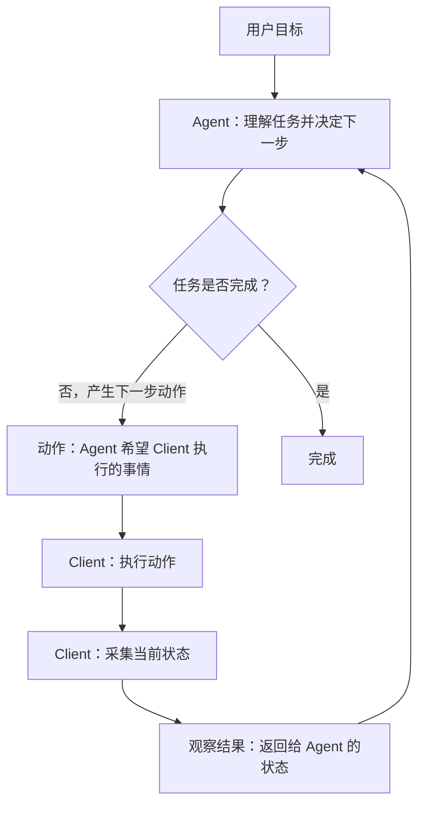

<!--
来源飞书文档: https://bytedance.larkoffice.com/docx/Ig24dLBTFoSSAfxwGV9csd6JnJf
Document ID: Ig24dLBTFoSSAfxwGV9csd6JnJf
Revision: 1483
导出时间: 2026-07-06T14:44:39
处理说明: 已移除“附录：demo演示”章节及其后续内容；未修改飞书原文档。
-->

# Codex Computer Use 背后的操作机制

## **一、背景介绍**

### **1.1 Computer Use 的重要性**

过去的软件自动化更偏向结构化接口：CLI、HTTP、CDP/playwright、MCP、AppleScript。这些方案稳定、快、可测试，但真实工作流里还有大量操作停留在 GUI 里。

在今年四月份，codex更新了computer use给，官方说法是 Codex 现在能够像人类一样，通过视觉识别、点击和输入，自主操控电脑上的各类应用程序。

https://openai.com/zh-Hans-CN/index/codex-for-almost-everything/

> Codex 现在能够像人类一样，通过视觉识别、点击和输入，自主操控电脑上的各类应用程序。即便有多个智能体在你的 Mac 上并行工作，它们也能与你互不干扰，确保你在其他应用中的日常操作流畅如初。对于开发者而言，这一特性在前端效果调试、应用测试，以及操作那些未开放 API 的应用时尤为得心应手。

这意味着 Codex 不再只是“写代码的 agent”，而是在尝试进入完整软件工程工作流：

写代码 -> 运行app -> 点击ui -> 观测运行结果，验证修改。


### **1.2 Codex 的 Computer Use 体验强在哪里**

> [MacStories: OpenAI’s New Codex App Has the Best Computer Use Feature I’ve Ever Tested](https://www.macstories.net/notes/openais-new-codex-app-has-the-best-computer-use-feature-ive-ever-tested/)

Codex 的 Computer Use 目前代表了桌面 AI 操作能力的前沿，在操作的精准度和可靠性上面相比竞品更成熟，并且最小程度地打扰用户的前台使用。


### **1.3 Codex Computer Use 背后的团队**

他们先做了 Workflow，被 Apple 收购后变成 **Shortcuts**（快捷指令——Apple 自家的自动化工具）

再从 Apple 出来做 Sky，最后 Sky 被 OpenAI 收购（ [正式宣布收购 Software Applications Incorporated](https://openai.com/index/openai-acquires-software-applications-incorporated/)）并进入 Codex 的 Mac computer use 体系，Codex 的 computer use feature 基于此前的 Sky app。

Sky 的收购金额没有公开。TechCrunch 报道说，Sky 背后的公司此前融资约 650 万美元

相关资料：

- [OpenAI acquires Software Applications Incorporated, maker of Sky](https://openai.com/index/openai-acquires-software-applications-incorporated/)
- [TechCrunch: OpenAI buys Sky, an AI interface for Mac](https://techcrunch.com/2025/10/23/openai-buys-sky-an-ai-interface-for-mac/)

---

## **二、实现思路**

无论是 Computer Use、Browser Use 还是浏览器插件，本质上都可以抽象成同一个循环：Agent 先决定下一步要做什么，Client 负责真正执行，然后把执行后的界面状态返回给 Agent。Agent 看完新的状态，再决定下一步动作。



这个循环里有两个关键概念：

**动作（Action）**Agent 希望客户端执行的事情。例如打开浏览器、访问网页、点击、输入、滚动、按键、截图、读取可访问树等。

**观察结果（Observation）**客户端执行动作后返回给 Agent 的状态。例如可访问树、DOM、页面截图、URL、窗口标题等。

对桌面 Computer Use 来说，动作最终会落到本机执行上，例如无障碍动作、目标进程事件投递、窗口截图或鼠标键盘事件；观察结果则来自可访问树（accessibility tree / AX tree）、窗口信息（window metadata）、截图和动作后的状态变化。真正复杂的地方不只是“能不能点一下”，而是如何把“执行动作”和“重新观察”组织成一个可以持续进行的循环。

## **三、方案选型**

### **3.1 桌面自动化工具路径对比**

在桌面 GUI 场景里，不同技术路径解决的是不同问题。它们不是互斥关系，而是分工协作：可访问树（accessibility tree / AX tree）负责理解界面，截图负责看到真实画面，输入事件负责执行动作，窗口路由（window routing）负责减少对用户的打扰。

1. **无障碍 API（Accessibility API / AX）**

它是 macOS 提供给辅助功能软件使用的界面语义层，可以把 App UI 读成一棵可访问树，里面包含控件类型、标题、状态、位置和可执行动作。对 Computer Use 来说，它既能帮助 Agent 理解“这个目标是什么”，也能直接执行 `AXPress`、`AXSetValue` 这类语义动作。

**优势：**结构化、稳定、容易验证；标准控件可以直接 `AXPress` 或 `AXSetValue`，不一定需要坐标点击。

**约束：**依赖目标 App 正确暴露无障碍信息；Canvas、自绘 UI、复杂 Electron 页面可能不完整。

**使用场景：**优先用于按钮、输入框、菜单、列表、滚动区等标准控件。

常见映射例子：

```HTML
<button>提交</button> 
映射为：
role: button
name: 提交
state: enabled / focused / pressed
action: press 

<input placeholder="搜索" /> 
映射为：
role: textField
name: 搜索
value: 当前输入内容
state: editable / focused
action: set value / focus

```

相比纯截图方案，其优势在于能够输出语义化的信息，例如按钮、链接，更利于agent进行理解。

<grid>
<column width-ratio="0.392831">

</column>
<column width-ratio="0.607169">

</column>
</grid>


1. **普通 CGEvent**

它是 macOS 里的底层输入事件模型，可以构造鼠标、键盘、滚动等事件。相比 AX action，它更接近真实用户操作，也更适合覆盖自绘控件、Canvas、hover、右键菜单、复杂手势这类没有清晰无障碍语义的场景。

**优势：**覆盖面广，不依赖目标控件有可访问语义。

**约束：**依赖当前桌面会话、前台窗口和全局坐标，容易移动真实鼠标、抢焦点或点错窗口。

**使用场景：**AX action 不可用，但需要模拟点击、滚轮、键盘、hover、右键菜单或复杂手势时使用。

1. **CGEvent.postToPid**

它仍然属于 `CGEvent` 路径，但目标是把事件尽量投递给指定进程，而不是简单发到全局鼠标键盘通道。它可以理解成普通 `CGEvent` 和完整后台操作之间的一层折中：仍然模拟真实输入，但目标更明确。

**优势：**比全局事件更可控，目标更明确，更适合减少对用户当前操作的影响。

**约束：**目标 App 未必接收模拟事件，后台窗口也不一定完整响应；响应后应用不一定会无副作用。

**使用场景：**在应用处于后台时 且Ax action不可用时，将事件投递给进程实现静默操作。

1. **视觉截图 / 坐标还原**

截图负责提供真实画面，坐标还原则负责把图片里的像素位置转换成窗口里的真实点击位置。它不是默认执行路径，而是当 AX 语义不够、界面是 Canvas / 自绘 UI，或者需要确认动作后视觉变化时使用的兜底能力。

**优势：**能处理可访问树看不到的图像、颜色、Canvas、loading 状态和动作后视觉变化。

**约束：**截图本身没有控件语义；

**使用场景：**作为兜底观察、视觉消歧、动作后验证，以及 Canvas / 自绘 UI 的像素点击路径。

1. **CDP / Playwright （浏览器自动化）**

CDP（Chrome DevTools Protocol）是 Chromium 系浏览器提供的调试和自动化协议，Playwright 则是在浏览器协议之上封装出的高层自动化框架。它们都属于浏览器内自动化能力，可以直接读取 DOM、URL、页面状态、网络请求，也可以执行导航、点击、输入、截图、等待和断言。它们不是桌面级 Computer Use，而是浏览器场景里的结构化执行后端。

**优势**：当任务明确发生在网页内时，更加稳定和可靠。

**约束**：难以复用用户的浏览器profile，比如登陆态等。且能力局限在浏览器内。

使用场景：网页自动化、Web 自动化测试、表单填写。

1. **浏览器插件**

通过浏览器插件与桌面端软件进行双向链接，链接后agent通过 -> 桌面端 -> 浏览器插件进行dom的观测与操作。

**优势：**可以复用用户的浏览器profile。

**约束：**能力局限在浏览器内。

1. **SkyLight / 其他macOS 内部接口**

这类接口属于 macOS 没有公开承诺给第三方使用的内部能力，可能触达更底层的窗口、会话和事件路由机制。它常出现在对后台窗口操作、多光标、接收事件但不拉起窗口等高级能力的逆向讨论里。

**优势：**能力可能更接近后台窗口路由、多光标、接收事件但不拉起窗口等高级形态。

**约束：**不稳定，系统升级后可能失效，也不能作为公开通用方案依赖。

**使用场景：**适合放在逆向分析和能力边界讨论里，不适合写成默认工程方案。


### **3.2 Codex 的聚合策略**

Codex Computer Use 的关键不是把多种能力简单堆在一起，而是把“看界面”和“操作界面”放进同一个任务循环里。模型只需要持续回答一个问题：当前界面下，下一步应该做什么；本地执行系统（runtime / driver）则负责判断应该看哪里、点哪里、用哪种方式执行，才能尽量少打扰用户。


**观察聚合：**读可访问树、窗口和进程信息、截图。目标是优先拿到结构化 UI 信息；当结构化信息不够时，agent再去读取截图。

**动作聚合：**把无障碍动作、普通输入事件、postToPid，放在同一层选择。目标是先用最稳定、最不打扰用户的方式，必要时再降级。

**验证聚合：**动作发出去以后，还要重新观察界面可访问树、记录操作日志、必要时对比前后截图，并处理超时和重试。目标是将执行的结果更好地展示给模型。

这套结构的意义在于，不把底层复杂性暴露给模型。


执行优先级比较合理的推测是：

```Plain Text
无障碍动作 / 设置值
> 元素位置 / 命中测试 + CGEvent.postToPid
> 截图定位 + CGEvent.postToPid
> 截图定位 + 普通 CGEvent / 桌面会话事件
> 全局鼠标键盘事件
> SkyLight（macOS 内部接口）

```

这个优先级是为了降低不确定性：越靠前的路径越结构化、越容易验证；越靠后的路径越接近真实输入，覆盖面更广，但副作用/失败概率也更高。

## **四、重点难点**

### 4.1 被遮挡和处于后台

这是 Computer Use 里很核心的难点。桌面操作系统默认是为单个前台用户设计的：一个前台 App，一个用户，一个焦点。

但 Computer Use 想做的是另一件事：

```Plain Text
用户继续保留真实鼠标键盘
Agent 在后台观察和操作目标窗口
目标窗口接收有效动作
但不抢焦点、不前置、不切 软件

```

这和 macOS 默认交互模型天然冲突。

```Plain Text
被遮挡 = 观察问题
目标窗口还在，但视觉上被别的窗口盖住。

处于后台 = 执行问题
目标 App / window 不是当前前台焦点，可能不接收输入事件。

```

被遮挡导致我们不能直接对整个屏幕进行截屏，而是需要我们通过无障碍api以及单窗口截图的方式获取应用信息。

被遮挡还会影响动作前后的验证。很多 Electron / Chromium 应用在前台时可访问树比较完整，但窗口被遮挡或处于后台后，树可能不更新、变稀疏，甚至只剩一层窗口壳。这样 Agent 不仅更难判断目标元素是否存在、是否可点击，也更难在动作后确认页面是否真的发生了预期变化。


处于后台的应用在执行操作时需要：

```Plain Text
点击目标 App
但不移动用户鼠标
不抢当前键盘焦点
不把目标窗口拉到前台
不影响用户正在做的事

```

普通 CGEvent 很容易进入全局输入路径，导致鼠标移动、焦点变化、窗口前置。

`postToPid` 可以把 CGEvent 尽量定向投递到目标进程，副作用更小，但它仍不保证后台窗口一定消费事件，也不能等同于完整的后台无打扰操作。

`AXPress` 对标准控件很好用，但无法覆盖 Canvas、自绘 UI、复杂手势、拖拽、hover、右键菜单等场景。


### 4.2 无障碍 API 不够

理想情况下，无障碍 API 能告诉我们“这里有个按钮、按钮叫提交、当前可点击”，并且支持我们进行交互。

但并不能保证所有 App 都把界面信息完整暴露出来，以及提供对应的控件给我们进行操作。这里有一个比较直接的研究数据可以参考：2025 年的 [Screen2AX](https://arxiv.org/abs/2507.16704) 论文调查 macOS 应用的无障碍元数据时提到，只有 **33% 的 macOS 应用提供完整无障碍支持**；论文同时说明他们整理了覆盖**112 个 macOS 应用** 的数据集，用来研究 UI 元素检测、分组和层级化无障碍元数据。

这个数字不能当作整个 macOS App Store 的全量普查，但它足够说明一个事实：可访问树是很重要的主路径，但不能假设所有应用都完整、准确、实时地暴露 UI 语义。常见风险集中在这些类型：

```Plain Text
标准 AppKit / SwiftUI 表单、按钮、列表：
  通常更容易拿到可用的可访问树。

Electron / Chromium / WebView：
  语义树可能存在，但复杂页面、虚拟列表、遮挡后台状态容易不稳定。

Canvas、WebGL、游戏、Metal、视频、重图形应用：
  很多内容无法通过无障碍语义直接观察。

```

可访问树很适合回答：

```Plain Text
可访问树擅长：
  控件类型 / 标题 / 当前值
  输入框、按钮、列表等标准语义
  元素位置和可执行动作
  无障碍点击 / 设置值

可访问树不擅长：
  Canvas 里画了什么
  Figma、复杂 Electron、自绘 UI
  颜色、视觉遮挡、loading 状态
  hover、拖拽、复杂手势

```

因此，可访问树是 Agent 的“界面目录”，也是标准控件操作的优先路径；截图则更适合承担兜底观察、视觉消歧和动作后验证。真正的 Computer Use 本地执行系统必须把可访问树、窗口信息、截图兜底、动作执行和验证组合起来，而不是把截图点击当成默认路径。

### 4.3 从截图坐标到真实点击位置

```Plain Text
click(x, y)

```

如果已经知道 `bundle_id` 和 `window_id`，协议可以简化很多。模型不需要理解整个桌面，也不需要关心多显示器、菜单栏、Dock、窗口偏移这些细节；它只需要在目标窗口里给出一个相对位置，让执行层去进行点击。

```Plain Text
click_window_point:
  bundle_id = com.tencent.QQMusicMac
  window_id = 123423
  window_x = 420
  window_y = 180

```

但这不代表坐标换算消失了，桌面端runtime 仍然需要处理：

```Plain Text
- 截图像素坐标和 macOS 逻辑点坐标的差异
- Retina scale
- 窗口 frame、标题栏、内容区偏移
- 多显示器全局坐标
- 窗口移动、缩放、切换 Space 后的重新校验
- CGEvent 最终使用的事件坐标

```

上层协议应该尽量使用“目标窗口内坐标”，底层 runtime 再负责把它还原成可投递的事件坐标。

### **4.4 后台操作如何不打扰用户（window suppression）**

Codex 最吸引人的地方，是它能在后台操作目标窗口，同时尽量不打扰用户。这个能力一般被称为窗口抑制（window suppression）。

这里可以简单理解成：

```Plain Text
- 不移动用户真实鼠标
- 不抢用户键盘焦点
- 不把目标窗口拉到前台
- 不切换 Space
- 仍然能让目标 App 接收点击、输入、滚动

```

这和 macOS 传统交互模型天然冲突。桌面系统默认假设：

```Plain Text
一个用户
一个鼠标
一个键盘
一个前台 App
一个接收键盘输入的窗口

```

而后台 Computer Use 想要的是：

```Plain Text
一个用户 + 多个 Agent
用户保留真实鼠标键盘
Agent 拥有虚拟光标
多个 App 可并行被操作
目标窗口不必前置

```

所以本地执行器不能只是模拟用户操作，而是要做**窗口级事件路由。**

这也是为什么社区逆向方案会继续讨论 SkyLight / macOS 内部接口：公开 API 能完成 P0 工程闭环，但要接近 Codex 展示的后台 Computer Use，还需要更复杂的后台事件路由和副作用抑制。

## **五、安装包静态逆向分析**

使用 Codex Computer Use 时，系统会提示授予辅助功能和屏幕录制权限。简单理解：辅助功能权限负责“读界面结构、操作标准控件”；屏幕录制权限负责“拿到屏幕或窗口画面”，用于视觉观察、坐标定位和动作后验证。


OpenAI 没有公开确认 Codex 底层是否调用 SkyLight，也没有公开具体符号或实现。所以下面不是权威结论，而是基于安装包静态分析和社区复现项目，解释我们能看到哪些能力痕迹，以及这些痕迹大概对应什么能力。

以我们安装的 Codex Computer Use 插件为例，关键二进制不在 `Codex.app` 的 Electron 主入口里，而在 bundled plugin 里：

```Plain Text
~/.codex/plugins/cache/openai-bundled/computer-use/1.0.793/
  Codex Computer Use.app/
    Contents/MacOS/SkyComputerUseService
    Contents/SharedSupport/SkyComputerUseClient.app
    Contents/SharedSupport/CUALockScreenGuardian.app

```

从 API 维度看，可以分成下面几类。

1. **无障碍 API：AXUIElement / AXObserver**

代表符号包括 `AXUIElementCreateApplication`、`AXUIElementCreateSystemWide`、`AXUIElementCopyAttributeValue`、`AXUIElementCopyActionNames`、`AXUIElementPerformAction`、`AXUIElementSetAttributeValue`、`AXUIElementCopyElementAtPosition`、`AXObserverCreateWithInfoCallback`、`AXObserverAddNotification`。

这组 API 说明它会读取可访问树、读取控件属性和 action、执行无障碍动作、设置控件值、监听 UI 变化，也会做坐标命中测试。

```Plain Text
当前 App 里有哪些按钮、输入框、菜单、列表？
这些控件叫什么、在哪里、当前是否可用？
这个元素能不能直接执行 AXPress / AXSetValue？
点击某个坐标时，坐标下面实际是哪一个 UI 元素？
动作后界面有没有发生变化？

```

所以 AX 的是把应用的界面转化为可读、可操作、可验证的 UI 语义。

1. **屏幕捕获 API：ScreenCaptureKit**

代表名字包括 `SCShareableContent`、`SCWindow`，并且二进制明确链接了 `ScreenCaptureKit.framework`。

这组 API 对应窗口 / 屏幕内容枚举和截图能力。它更像是视觉观察路径：当 AX tree 不够完整，或者需要动作后确认真实视觉变化时，可以拿到窗口级画面。


1. **窗口和坐标 API：CoreGraphics / CGWindow / CGRect**

代表符号包括 `CGWindowListCopyWindowInfo`、`CGWindowListCreate`、`CGWindowListCreateDescriptionFromArray`、`CGWindowLevelForKey`、`CGDisplayBounds`、`CGDisplayCreateUUIDFromDisplayID`、`CGSessionCopyCurrentDictionary`、`CGRectContainsPoint`、`CGRectIntersection`、`CGRectGetMinX`、`CGRectGetMaxY`、`CGAffineTransformMakeScale`。

这组 API 说明它需要知道窗口是谁、在哪里、层级如何，以及如何在截图坐标、窗口坐标、屏幕坐标之间换算。单窗口截图如果不配合这些窗口和坐标 API，就无法可靠还原点击位置。

可以把它理解成 Computer Use 的“窗口地图和坐标换算层”。它负责把这些信息串起来：

```Plain Text
这个 App 当前有哪些窗口？
窗口属于哪个屏幕、哪个坐标范围？
截图里的 pixel_x / pixel_y 对应窗口里的哪个点？
多屏幕、Retina 缩放、窗口移动后坐标有没有失效？

```


1. **图像处理 API：CGImage / CGContext / ImageIO**

代表符号包括 `CGBitmapContextCreate`、`CGBitmapContextCreateImage`、`CGImageGetWidth`、`CGImageGetHeight`、`CGImageSourceCreateWithData`、`CGImageDestinationCreateWithURL`、`CGImageDestinationAddImage`、`CGImageDestinationFinalize`。

这组 API 说明它不只是拿窗口列表，还会处理图像数据，例如截图保存、缩略图生成等。可以把它理解成 Computer Use 的“截图加工层”，它负责处理截图本身。


1. **输入事件 API：CGEvent 相关类型**

字符串里能看到 `CGEvent`、`CGEventTapLocation`、`CGEventType`、`CGEventFlags`、`CGEventSource`、`CGMouseButton`、`CGScrollEventUnit` 等名字。

这说明它存在非 AX 的事件模型相关代码。但这次静态扫描没有直接看到 `CGEventPostToPid`、`CGEventPost`、`CGEventCreateMouseEvent` 这类明确投递函数，所以不能直接断言 Codex 的事件投递后端就是 `CGEventPostToPid`。

可以把它理解成 Computer Use 的“真实输入事件层”。当 AX action 不够用时，它可能需要构造更接近真实用户操作的事件：

```Plain Text
鼠标点击：mouseDown / mouseUp
滚动：scroll wheel
键盘：keyDown / keyUp
修饰键：Command / Shift / Option / Control
复杂动作：拖拽、右键、hover、连续滚动

```

这类能力的价值是覆盖面更广，尤其适合 Canvas、自绘 UI、复杂菜单、拖拽和 hover；风险是副作用更大，可能和焦点、前台窗口、坐标换算、后台事件消费有关。

1. **桌面状态 API：AppKit / NSWorkspace**

代表符号包括 `NSWorkspaceActiveSpaceDidChangeNotification`、`NSWorkspaceDidActivateApplicationNotification`、`NSWorkspaceDidTerminateApplicationNotification`、`NSWorkspaceApplicationKey`。

这组 API 说明它会关注 Space 切换、App 激活、App 退出等桌面状态变化。后台 Computer Use 要避免打扰用户，就必须知道当前桌面环境正在发生什么。

```Plain Text
用户当前激活的是哪个 App？
目标 App 是否被激活、退出或重新启动？
Agent 的动作有没有意外把目标窗口拉到前台？
用户当前桌面上下文有没有被打断？

```

1. **系统自动化和原生 App 框架**

二进制链接了 `ScriptingBridge.framework` 和 `AppKit.framework`。

```Plain Text
ScriptingBridge：调用支持脚本化的 macOS App 能力
AppKit：处理原生窗口、菜单、事件循环和 App 生命周期

```

这类框架的意义是：桌面自动化不一定只有“模拟输入”这一条路。有些任务如果能通过系统自动化、原生控件或应用自身能力完成，通常会比坐标点击更稳定。

1. **更底层的窗口和会话状态痕迹**

静态分析能看到 `dlopen`、`dlsym`、`WindowServerSPI`、`WindowServerEvent`、`CGSSessionScreenIsLocked`、`CGSSessionSecureInputPID`、`CGSessionCopyCurrentDictionary` 这类动态加载和 WindowServer / 桌面会话状态相关痕迹。

`dlopen` / `dlsym` 可以理解为“运行时再去查找某个系统能力”，而不是在编译时直接写死依赖。`WindowServer` 则更接近 macOS 管理窗口、屏幕、层级和输入会话的底层服务。


**总结：**

这些符号说明 Codex Computer Use 至少具备“AX 语义层 + 屏幕视觉层 + 窗口坐标层 + 输入事件层 + 桌面状态监听层 + 原生自动化层”的完整工具链，而不是一个简单的纯视觉点击器。


第三方项目可以作为实现思路参考，比如 Cua Driver 和 Hermes Agent 文档会提到 `SLEventPostToPid`、`SLPSPostEventRecordTo`、`_AXObserverAddNotificationAndCheckRemote` 这类接口，用来实现目标进程事件投递、接收事件但不拉起窗口、被遮挡 Chromium / Electron 可访问树保活等能力。

[https://cua.ai/docs/cua-driver/guide/getting-started/introduction](https://cua.ai/docs/cua-driver/reference/mcp-tools)

https://hermes-agent.nousresearch.com/docs/user-guide/features/computer-use


## **六、实现阶段以及路线**

按能力层级逐步展开，先实现“能读懂标准控件、能操作标准控件”，再实现“能锁定目标窗口、把事件发给目标进程、用截图兜底”，以及距离完整后台 Computer Use 还差哪些更底层能力。

### **6.1 第一阶段：Appkit + 无障碍 API**

通过Appkit，我们可以获取到本机所安装的应用，以及他们的bundle_id、pid。

这一阶段要实现的是公开无障碍 API 能覆盖的主路径：

```Plain Text
观察：
  list_apps
  get_app_state
  读取可访问树、控件类型、标题、当前值、位置、可执行动作
  将可访问树映射为可以让agent理解的格式文本

动作：
  click 优先走无障碍点击动作
  set_value 优先走无障碍设置值
  scroll 优先走无障碍滚动动作或滚动条

验证：
  无障碍api的返回
  执行动作后重新读取可访问树查看变化

```

这一阶段的重点是标准控件可以通过结构化语义完成观察和动作，不需要执行鼠标事件操作。

### **6.2 第二阶段：窗口注册表（Window Registry）+ CGEvent**

这一阶段要实现的是目标窗口和目标进程的稳定绑定。

```Plain Text
Window Registry:
  bundle id：应用身份，表示哪个 App，例如 com.tencent.QQMusicMac、com.google.Chrome
  window id：窗口身份，表示这个 App 里的哪个具体窗口
  title
  hidden / minimized / occluded 状态：是否隐藏、最小化、被遮挡
  related pids：相关子进程，例如 parent / renderer / helper / gpu / network

```

这里要特别注意 Electron / Chromium 类应用。它们表面上是一个 App，但内部通常会拆成主进程、渲染进程、GPU 进程、网络进程等多个子进程。窗口注册表需要记录这些相关进程，用于诊断可访问树不更新、渲染进程冻结、WebView 内容异常等问题；但动作路由默认不应该投给渲染子进程。


当无障碍语义动作不可用时，可以降级到 CGEvent 事件；如果已经通过窗口注册表拿到可靠的 `owner_pid`，优先使用 `CGEvent.postToPid`，尽量把事件发给目标进程；只有用户明确允许时，才考虑更普通的桌面会话 / 全局 CGEvent（session / global CGEvent）。

```Plain Text
click:
  先尝试 accessibility-api
  如果没有可用无障碍动作，再用元素位置计算目标点
  优先通过 CGEvent.postToPid 投递到目标进程
  只有在用户明确允许时，才退到普通桌面会话 / 全局 CGEvent

type_text:
  无 element_index 时，向目标 App 当前输入响应者投递键盘事件

scroll:
  无障碍滚动没有变化时，再尝试目标进程滚轮事件

```

### **6.3 第三阶段：应用截图，鼠标点击机制（pixel click）**

这一阶段的重点不是“能截一张图”，而是把截图和点击绑定到同一个目标窗口。只要已经知道 `bundle_id` 和 `window_id`，模型就不需要理解整个桌面的坐标系统，只需要在目标窗口截图里选择一个点；真正的坐标换算和事件投递交给 runtime。

```Plain Text
capture_window:
  只捕获目标窗口
  返回 bundle_id、window_id、图片路径、窗口 frame、截图尺寸、scale_factor

click_window_pixel:
  输入同一张截图里的 pixel_x / pixel_y
  使用同一个 window_id 找回目标窗口
  runtime 把截图像素坐标还原成窗口内逻辑坐标
  runtime 再转换成事件投递需要的坐标
  默认向目标窗口所属进程投递点击事件

```

对外协议可以保持很简单：

```Plain Text
capture_window(bundle_id)
  -> window_id
  -> screenshot_width / screenshot_height
  -> scale_factor
  -> window_frame

click_window_pixel(window_id, pixel_x, pixel_y)

```

这样做的价值是：模型只处理“这张目标窗口截图里的点”，不会被菜单栏、Dock、多显示器、窗口偏移干扰；runtime 则负责处理 Retina 缩放、窗口 frame、标题栏偏移、事件坐标和窗口移动后的重新校验。

### 6.4 第四阶段：通过SPI完善后台 Computer Use 的能力

前三个阶段已经能完成一条 P0 链路：

```Plain Text
第一阶段：
  用无障碍 API 读取标准控件
  优先执行 AXPress / AXSetValue

第二阶段：
  用窗口注册表锁定 bundle_id、window_id、owner_pid
  在需要真实输入事件时，优先尝试 CGEvent.postToPid

第三阶段：
  用单窗口截图做兜底观察
  把截图里的 pixel_x / pixel_y 绑定回同一个 window_id

```

这套能力已经能证明“能看见目标窗口、能定位目标窗口、能尝试把动作送给目标进程”。但它还不是完整后台 Computer Use。第四阶段新增解决的是：**目标窗口在后台、被遮挡、不是当前焦点时，仍然能稳定接收动作，并且尽量不打扰用户当前桌面。**

第1类是 **窗口级事件投递（WindowServer / SkyLight event delivery）**。

cgevent的postToPid 可以把事件尽量送到目标进程，已经比全局鼠标事件更可控，且不会直接干扰到前台应用。但相比SkyLight的SLEventPostToPid，其可能不被进程接收，导致操作无效。

> `SLEventPostToPid`它无需通过 HID 客户端即可向特定进程发布合成事件；`SLPSPostEventRecordTo`无需抬起窗口即可切换 AppKit 激活状态；`_AXObserverAddNotificationAndCheckRemote`即使窗口被遮挡，也能保持 Electron 应用的辅助功能树正常运行。

https://github.com/trycua/cua/blob/main/blog/inside-macos-window-internals.md


第2类是 **被遮挡 Electron 的可访问树保活（AX tree keep-alive）**。

Electron / Chromium App 在前台时，可能能读到完整按钮、输入框和列表；但当窗口被遮挡、隐藏或切到其他 Space 时，可访问树可能变稀疏，甚至只剩一层窗口壳。此时 Agent 会失去结构化语义，只能退到更脆弱的像素定位。
