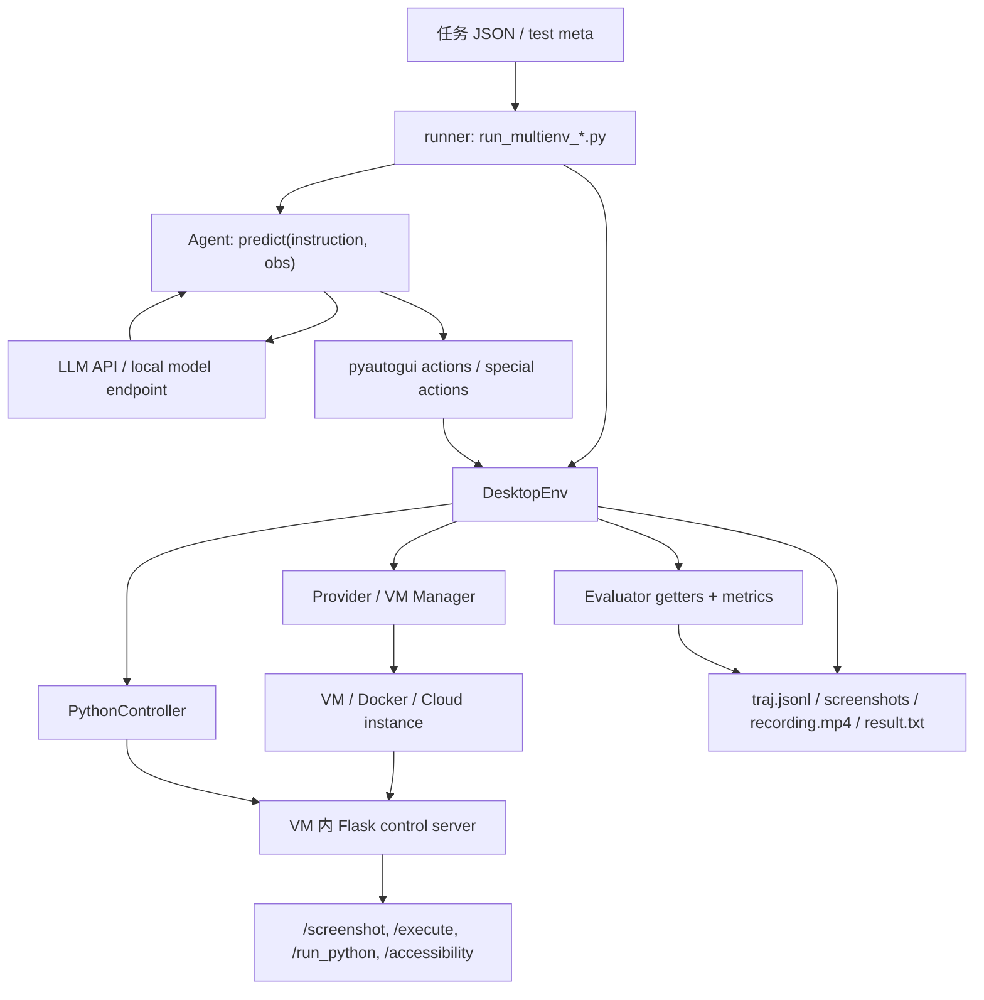
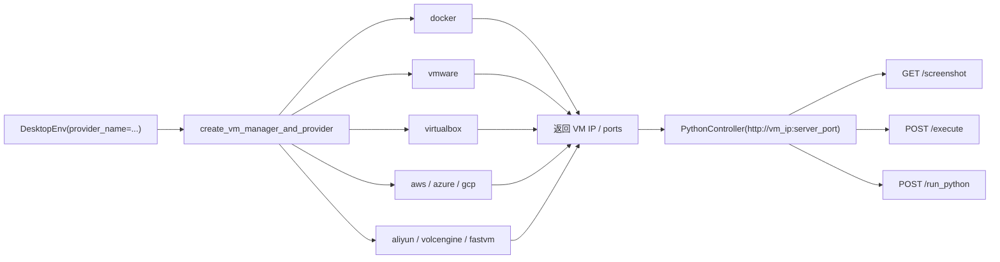
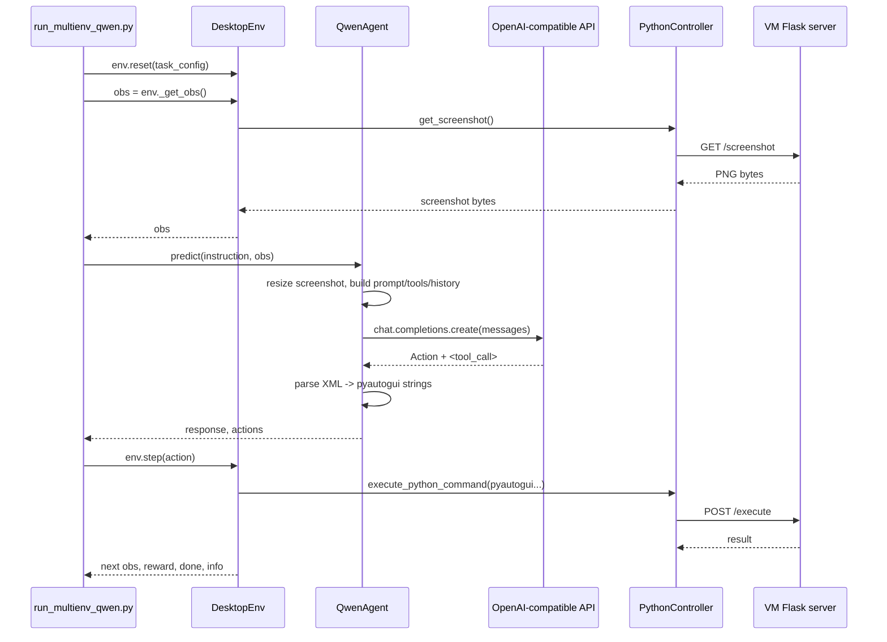
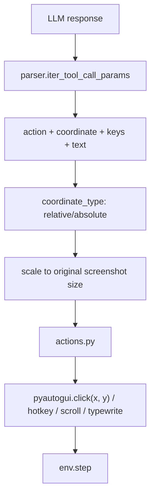
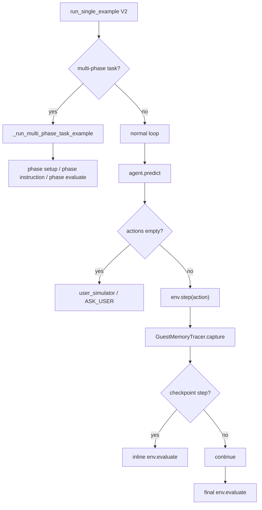
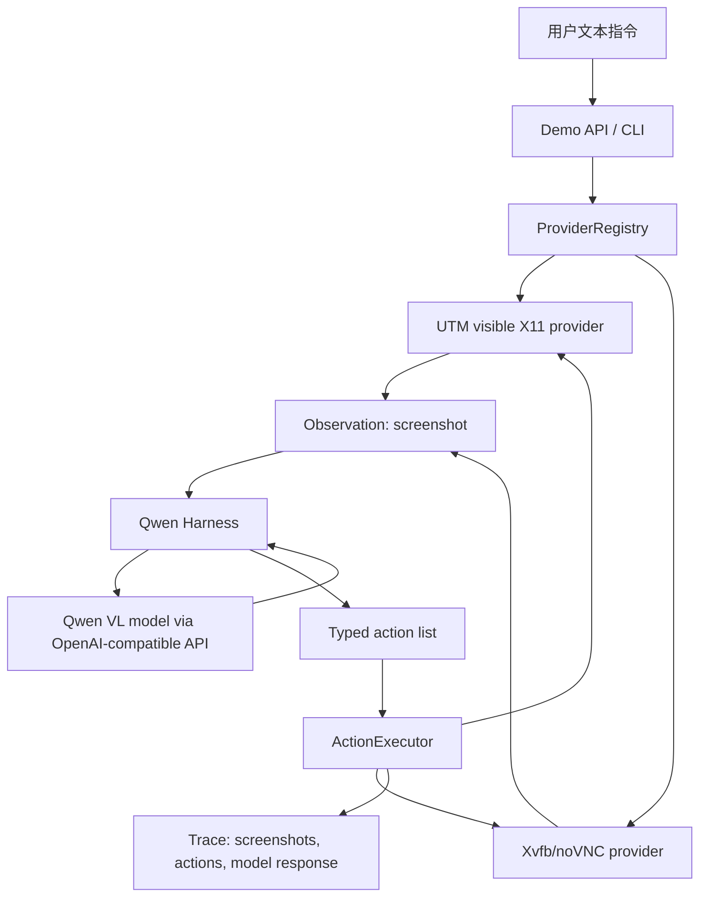

# OSWorld / OSWorld-V2 Qwen Computer Use 架构调研

调研时间：2026-07-02
范围：`/Users/vaehoho/go/src/Zwx-CN/OSWorld` 与 `/Users/vaehoho/go/src/Zwx-CN/OSWorld-V2` 本地代码。
安全说明：本次只做源码与 CLI 调研，没有调用任何 LLM。

## 0. 先给结论

1. OSWorld 不是一个单纯的 Qwen harness，而是完整评测框架：runner 负责并发与任务分发，`DesktopEnv` 负责 VM/provider/controller/evaluator，agent 只要实现 `predict(instruction, obs) -> (response, actions)` 就能接入。
2. Qwen 没有依赖原生 Computer Use API。OSWorld 的做法是把截图和工具 schema 发给 OpenAI-compatible / DashScope-compatible Chat Completions，让模型输出 XML/JSON 形式的 `computer_use` 调用，再由本地 parser 转成 `pyautogui` 代码执行。这正是我们需要的 harness 思路。
3. OSWorld 当前仓库里最值得借鉴的是新的模块化 `mm_agents/qwen/`：`main.py`、`prompts.py`、`history.py`、`images.py`、`parser.py`、`actions.py`、`client.py` 分层清楚，可直接学习。
4. OSWorld-V2 的评测框架更成熟：多阶段任务、checkpoint evaluation、user simulator、memory tracing、结果 JSON 化。但 V2 本地代码没有发现 `mm_agents/qwen/` 目录，也没有发现 `scripts/python/run_multienv_qwen.py`，Qwen 主要散在 `qwen25vl_agent.py`、`qwen3vl_agent.py`、`qwen35vl_agent.py`、`qwen_internal_agent.py`。
5. 如果我们的目标是 demo，不建议直接搬整套 OSWorld。建议抄它的 agent/harness 形状和 provider 边界，保留我们自己的轻量 VM provider 与 HTTP control server。

## 1. 证据等级

- 直接证据：来自本地源码/README 的确定事实。
- 强推断：多处源码共同支持，但没有一句 README 明说。
- 弱推断：基于结构和命名判断，后续需要跑 smoke test 或问上游确认。

本文关键判断基本都是直接证据或强推断。

## 2. OSWorld 全貌

OSWorld 的核心闭环是：



关键文件：

- OSWorld runner：`/Users/vaehoho/go/src/Zwx-CN/OSWorld/scripts/python/run_multienv_qwen.py`
- OSWorld 单任务循环：`/Users/vaehoho/go/src/Zwx-CN/OSWorld/lib_run_single.py`
- OSWorld 环境：`/Users/vaehoho/go/src/Zwx-CN/OSWorld/desktop_env/desktop_env.py`
- controller：`/Users/vaehoho/go/src/Zwx-CN/OSWorld/desktop_env/controllers/python.py`
- VM 内 server：`/Users/vaehoho/go/src/Zwx-CN/OSWorld/desktop_env/server/main.py`
- provider factory：`/Users/vaehoho/go/src/Zwx-CN/OSWorld/desktop_env/providers/__init__.py`

`DesktopEnv` 是框架的中心：初始化 provider，启动/获取 VM，创建 `PythonController`，`_get_obs()` 拉截图/a11y/terminal，`step()` 执行动作，`evaluate()` 运行任务评分器。

## 3. Provider / Controller 设计

OSWorld 的 provider 层解决“机器在哪里”的问题，controller 层解决“怎么操作机器”的问题。



直接证据：

- OSWorld provider factory 支持 `vmware`、`virtualbox`、`aws`、`azure`、`docker`、`aliyun`、`volcengine`、`fastvm`。
- OSWorld README 说 macOS 一般不支持 KVM，想在 macOS 跑 OSWorld 建议 VMware；Docker 更适合 Linux/KVM。
- OSWorld-V2 README 说 2.0 官方当前主要提供 Docker 和 AWS 镜像，但 provider 层代码还包含 VMware、Azure、GCP、Aliyun、Volcengine。

对我们 demo 的含义：

- UTM 不是 OSWorld 的官方 provider，但它可以作为我们自己的 `provider_name=utm`。
- 真正该复用的是 provider 接口设计，不是强行塞进 OSWorld 的 VMware/Docker 实现。
- VM 内 control server 这个思路很适合我们：宿主只需要知道 `base_url`，不用每次 SSH。

## 4. OSWorld Qwen 主链路

OSWorld 当前仓库有一个新的模块化 Qwen 包：

```text
mm_agents/qwen/
  README.md
  __init__.py
  main.py       # QwenAgent / _QwenBaseAgent
  prompts.py    # computer_use tool schema + system prompt
  history.py    # multimodal messages + screenshot folding
  images.py     # resize/base64 + coordinate scaling
  parser.py     # XML tool_call parsing
  actions.py    # tool params -> pyautogui code
  client.py     # OpenAI-compatible Chat Completions + retry
```

调用链：



`QwenAgent` 的限制很明确：

- 只支持 `action_space == "pyautogui"`。
- 只支持 `observation_type == "screenshot"`。
- 只支持 OpenAI-compatible API。
- API 配置来自 CLI 参数 `--base_url` / `--api_key`，或环境变量 `OPENAI_BASE_URL` / `OPENAI_API_KEY`。

README 示例直接写了：

```bash
python scripts/python/run_multienv_qwen.py \
  --model qwen3.7-plus \
  --base_url "$OPENAI_BASE_URL" \
  --api_key "$OPENAI_API_KEY"
```

这说明 leaderboard/本地 runner 所说的 `qwen3.7-plus` 在这条链路里是“OpenAI-compatible chat completion model 名称”，不是 OSWorld 原生 CU 能力。

## 5. Qwen 的 harness 具体怎么做

Qwen 模型看到的是：

1. system prompt：告诉模型它可以用 `computer_use` 工具。
2. 当前截图：base64 PNG。
3. instruction：任务说明。
4. previous actions：历史动作摘要。
5. 历史截图：超过窗口后会被折叠成固定文本。

模型必须输出类似：

```xml
Action: click the Home folder.
<tool_call>
<function=computer_use>
<parameter=action>
left_click
</parameter>
<parameter=coordinate>
[123, 456]
</parameter>
</function>
</tool_call>
```

本地 harness 再做：



值得直接借鉴的点：

- relative 坐标统一成 1000x1000，再按原图尺寸缩放，降低不同分辨率差异。
- `image_max` / `fold_size` 用于折叠旧截图，避免上下文爆炸。
- 把 message dump 到 `draft/message_cache`，方便复盘模型到底看到了什么。
- `WAIT` / `DONE` / `FAIL` 作为特殊动作，不走 pyautogui。
- parser 和 prompt 分开，便于换模型时调格式。

需要注意的点：

- `type` 仍会落到 `pyautogui.typewrite`，中文输入天然不稳。我们的 demo 后续应加 clipboard paste action。
- Qwen parser 是字符串级 XML/JSON 解析，不是严格结构化 function calling；需要防御格式漂移。
- `pyautogui` 字符串远程执行能力很强，生产化前要加 allowlist / sandbox / audit。

## 6. OSWorld-V2 的变化

V2 的大变化不在 Qwen，而在评测执行器和任务形态：



V2 关键增强：

- 多阶段任务：每个 phase 可以有自己的 setup、instruction、evaluate、gate。
- user simulator：如果 agent 不返回动作，框架会把 response 当成问题，自动回答并写入 `obs["user_response"]`。
- checkpoint evaluation：可以在指定 step 做中间评估。
- memory tracing：每步记录 guest 内存/CPU/网络等资源快照。
- 结果更结构化：`result.json`、`checkpoint_results.json`、`phase_results.json` 等。

V2 与 Qwen 的关系：

- `qwen3vl_agent.py` / `qwen25vl_agent.py`：老式单文件 agent，prompt、history、API、parse 都在一个文件里。
- `qwen35vl_agent.py`：更接近 OSWorld 新模块化 Qwen 包的前身/平行版本，支持 OpenAI-compatible API、XML tool call、screenshot folding。
- `qwen_internal_agent.py`：继承 `Qwen35VLAgent`，扩展内部工具 schema，支持 `key_down`、`key_up`、`left_mouse_down`、`left_mouse_up`、`call_user`、`screenshot` 等。
- `maestro/core/engine.py`：`LMMEngineQwen` 用 DashScope OpenAI-compatible endpoint，默认 `https://dashscope.aliyuncs.com/compatible-mode/v1`，API key 来自 `DASHSCOPE_API_KEY`。

## 7. V1/当前 OSWorld vs OSWorld-V2 对比

| 维度 | OSWorld 当前仓库 | OSWorld-V2 |
|---|---|---|
| Qwen 推荐入口 | `mm_agents/qwen.QwenAgent` + `scripts/python/run_multienv_qwen.py` | 未发现同名 runner；按 V2 README 应从 Claude/GPT runner 迁移 |
| Qwen 代码组织 | 新模块化包，职责拆得清楚 | 多个单文件 agent，另有 `qwen_internal_agent.py` |
| API 形态 | OpenAI-compatible，`OPENAI_BASE_URL` / `OPENAI_API_KEY` | Qwen35/internal 用 OpenAI-compatible；Maestro 用 DashScope env |
| 输出格式 | XML `<tool_call><function=computer_use>` | Qwen3/25 多为 JSON-in-XML；Qwen35/internal 为 XML parameter |
| 执行动作 | parser 转 pyautogui 字符串，`env.step` 执行 | 同类机制 |
| 评测执行器 | 简单 reset -> predict -> step -> evaluate | 多阶段、用户模拟器、checkpoint、memory tracing |
| provider | docker/vmware/virtualbox/aws/azure/aliyun/volcengine/fastvm 等代码路径 | README 强调 Docker/AWS 官方镜像，代码层 provider 更多 |

## 8. 对我们 demo 的建议路线

### 8.1 现在就该抄什么

1. 抄 Qwen harness 的分层，而不是抄整个 OSWorld：
   - `PromptBuilder`
   - `MessageHistory`
   - `ImagePreprocessor`
   - `ToolCallParser`
   - `ActionExecutor`
   - `Provider`
2. 采用 OSWorld 的 `predict -> actions -> env.step -> obs` 循环。
3. 保留 provider 抽象：
   - `visible_utm_x11`：当前 UTM `:0.0` 可视桌面。
   - `xvfb_novnc`：后续专用后台桌面。
   - `docker_osworld_like`：后续 Linux/KVM 或云端。
4. 复用 Qwen 的 1000x1000 relative coordinate 思路。
5. 加强 OSWorld 没做好的中文输入：新增 `clipboard_paste(text)` 工具，不要只靠 `typewrite`。

### 8.2 暂时不该抄什么

1. 不要把 OSWorld 任务/evaluator 全搬进 demo。那是 benchmark 资产，不是 demo 核心。
2. 不要上来就实现 snapshot/revert、多 provider 云调度、checkpoint eval。
3. 不要把 `pyautogui` 任意字符串执行暴露给外部用户；demo 阶段可以，产品阶段必须收敛成 typed action allowlist。

### 8.3 最小可行架构



## 9. 具体落地计划

1. 第一阶段：把现有 demo 改成 OSWorld-like harness。
   - 输入：`instruction + screenshot + previous actions`
   - 输出：typed actions，而不是直接散落的 pyautogui 字符串
   - provider：保留 UTM visible X11
2. 第二阶段：加 `xvfb_novnc` provider。
   - Xvfb `:99`
   - window manager
   - noVNC/websockify
   - control server 绑定专用 DISPLAY
3. 第三阶段：补 trace/replay。
   - 每步保存 screenshot、model response、parsed action、execution result
   - 前端可以播放轨迹
4. 第四阶段：参考 V2 做 evaluator-lite。
   - 先支持人工判断或简单视觉/文件断言
   - 后续再接 benchmark 风格 evaluator

## 10. 关键源码索引

- OSWorld Qwen README：`/Users/vaehoho/go/src/Zwx-CN/OSWorld/mm_agents/qwen/README.md`
- OSWorld Qwen 主实现：`/Users/vaehoho/go/src/Zwx-CN/OSWorld/mm_agents/qwen/main.py`
- OSWorld Qwen API client：`/Users/vaehoho/go/src/Zwx-CN/OSWorld/mm_agents/qwen/client.py`
- OSWorld Qwen prompt：`/Users/vaehoho/go/src/Zwx-CN/OSWorld/mm_agents/qwen/prompts.py`
- OSWorld Qwen history：`/Users/vaehoho/go/src/Zwx-CN/OSWorld/mm_agents/qwen/history.py`
- OSWorld Qwen image/坐标：`/Users/vaehoho/go/src/Zwx-CN/OSWorld/mm_agents/qwen/images.py`
- OSWorld Qwen parser/action：`/Users/vaehoho/go/src/Zwx-CN/OSWorld/mm_agents/qwen/parser.py`、`/Users/vaehoho/go/src/Zwx-CN/OSWorld/mm_agents/qwen/actions.py`
- OSWorld Qwen runner：`/Users/vaehoho/go/src/Zwx-CN/OSWorld/scripts/python/run_multienv_qwen.py`
- OSWorld 单任务执行：`/Users/vaehoho/go/src/Zwx-CN/OSWorld/lib_run_single.py`
- OSWorld DesktopEnv：`/Users/vaehoho/go/src/Zwx-CN/OSWorld/desktop_env/desktop_env.py`
- OSWorld controller：`/Users/vaehoho/go/src/Zwx-CN/OSWorld/desktop_env/controllers/python.py`
- OSWorld VM server：`/Users/vaehoho/go/src/Zwx-CN/OSWorld/desktop_env/server/main.py`
- OSWorld-V2 单任务执行：`/Users/vaehoho/go/src/Zwx-CN/OSWorld-V2/lib_run_single.py`
- OSWorld-V2 Qwen35：`/Users/vaehoho/go/src/Zwx-CN/OSWorld-V2/mm_agents/qwen35vl_agent.py`
- OSWorld-V2 Qwen internal：`/Users/vaehoho/go/src/Zwx-CN/OSWorld-V2/mm_agents/qwen_internal_agent.py`
- OSWorld-V2 Maestro Qwen engine：`/Users/vaehoho/go/src/Zwx-CN/OSWorld-V2/mm_agents/maestro/core/engine.py`
- OSWorld-V2 migration guide：`/Users/vaehoho/go/src/Zwx-CN/OSWorld-V2/docs/MIGRATING_FROM_OSWORLD_V1.md`

## 11. 最后的判断

如果我们只是要让国产视觉模型操作 Linux 桌面，OSWorld 已经证明这条路可以跑通：不需要模型原生 CU，只需要一个足够稳的 screenshot-to-tool-call harness。

最适合我们的策略是：用 OSWorld 的 Qwen agent 设计做参考实现，用 OSWorld-V2 的执行器设计做未来路线图，当前 demo 保持轻量。这样既能很快跑通 UTM/X11，又不会太早背上 benchmark 框架的复杂度。
